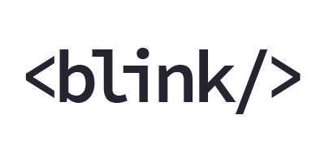

BlinkTextView
=============


**A TextView that blinks, just like the good old HTML `<blink>` tag.**

Because, why not? Also, this is a birthay gift. Happy Birthday, Daniele!



### Usage
Wait, what? Seriously?

LOL ok. Clone the repo, and reference the thing:

``` groovy
dependencies {
    compile project(':lib')
}
```

I'd suggest to copy-paste the `lib` folder to your project root and maybe rename it to something like _annoyingthingy_.
That's way more representative of what the lib does.

### What's super cool* about it

We have a magnificent **OCD mode**. It will randomly change the blink period so that it's even more effective. Make
each of your blinks completely unique, your users will want to "thank" you! Guaranteed.

Also, you can't change the default blinking period. There's sound science behind it. Also, writing getters and setters
is boooring. It's boring even when the IDE can generate them automatically, yes.

Oh, about that *, read: _annoying_

### License
This library is...

No, can't keep a straight face saying it, sorry. Let me try again.

This _library_ is released under a very liberal [Apache 2.0 license](http://www.apache.org/licenses/LICENSE-2.0.html).
Basically, do whatever you want with it, but don't blame us if your users/clients/loved ones/imaginary friends will
want to kill you for using it. Also, be nice and put our name somewhere (so that you can blame us for it!).

Usually people buries the OSS credits somewhere in their settings screen, at the bottom, under a sub item, and then you
have to walk 120 steps to the East, turn around three times while saying "Cicciput!", jump, grab a portal gun, open a
portal under your feet and another on that remote wall up there, touch your nose and the credits will appear behind you.

That's fine with us. But I digress.

### Demo

There is no demo. No, seriously. Build it yourself. Hell, it's a blinking thing!